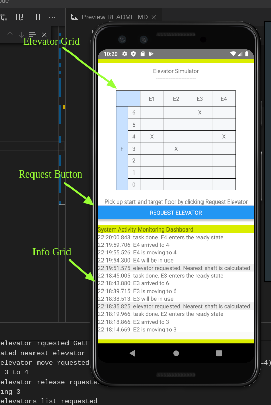
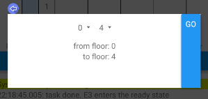
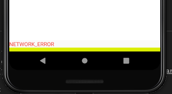

# Elevators Simulator

Application was run and tested with support of Pixel-3_API-28 image and:

- npm v6.13.4
- node v13.6.0
- AVD emulator v29.3.4.0 (android-studio v191)

## Run build and start app (quick steps)

### Backend

Execute in turn:

```bash
cd server && mvn clean install
java -jar target/elevator-1.0-SNAPSHOT.jar
```

You should be able to get elevator list at http://localhost:8080/elevator/api/v1/list

### Frontend

Before you start, make sure the ANDROID_HOME and access to sdk tools is set up correctly. You can add into .bash_profile or .bashrc or other shell settings file the following:

```bash
export ANDROID_HOME=/home/$USER/Android/Sdk
export PATH=$ANDROID_HOME/emulator:$ANDROID_HOME/platform-tools:$ANDROID_HOME/build-tools/<build-tools-version-number>:$PATH
```

This will expose to OS all required Android SDK apps and tools.

Execute the following:

```bash
cd ui
npm install
npm run emulator
npm run server
npm run android
```

## App UI description and short user guide

### Main app components

Main application window view:



#### Elevator grid

In the main screen there is elevator grid simulating elevators state. The X characters represents current elevator host floor. When request for elevator is executed those symbols move up and down across the grid. 

#### Request action button

The modal window is open by pressing "REQUEST ELEVATOR" button. You can find a dropdown there where you can pick up the start floor (fromFloor) and the destination floor (toFloor). Selection that is made shows imadiatelly in the fields below.



> NOTE: for some reason I could not force dropdown component to follow mouse wheel scrolling. You should click on the drop down and slide it content with the mouse button pressed.  

When selection is done press GO button that you can find on the right. This will trigger simulation based on selection that was made.

Few words about elevator selection algorithm. 
The elevator being closest the fromFloor will be returned for action. So if elevator E4 is on 5th floor and the rest of elevators are on 0, and you will pick up travel fromFloor 6 toFloor 3, the E4 will be chosen for service. 
If there are 3 on the 5th floor, the first with lowest id will be moved, etc. 

#### Info grid

In the info grid there are reports showing what's going on in the system. When elevator moves reports are appended into dashboard (newest on the top, older goes down). Dashboard supports scrolling in case there is a lot of informaton. It refreshes automatically but also supports manual refreshing (can be done by swapping down the component).

And maybe one last word about error messages. There is a very simple error message handling and you can find following picture in case of some issues:



Above is shown when BE service is down.